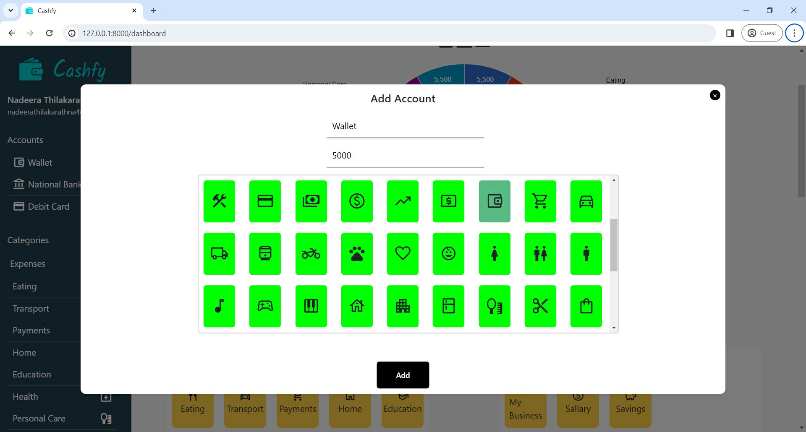

# Cashfy

## Personal Finance Management Web Solution using Django

## Table of Contents
- [Introduction](#introduction)
- [Technologies Used](#technologies-used)
- [Features](#features)
  - [1. Login/Signup](#1-login-signup)
  - [2. Add Account](#2-add-account)
  - [3. Categories](#3-categories)
    - [3.1 Expense](#31-expense)
    - [3.2 Income](#32-income)
  - [4. Add Expense](#4-add-expense)
  - [5. Add Income](#5-add-income)
  - [6. Data Visualization](#6-data-visualization)
- [License](#license)

## Introduction

Cashfy is a web application developed for personal finance management. It empowers users to track their day-to-day incomes and expenses, providing instant visualizations based on customizable date, weeks, months, years, or all, and choosing their accounts.

## Technologies Used

- Python
- Django
- PostgreSQL
- HTML
- JavaScript
- CSS

## Features

### 1. Login/Signup

Users can create an account by providing their first name, last name, email, and password. Afterward, users can log in using their email and password.

### 2. Add Account

Users can add their accounts by entering the account name, initial balance, and choosing an icon. You can add your wallet, bank accounts, cards etc.

### 3. Categories

#### 3.1 Expense

Users can add expense sources by entering the name and choosing an icon.

#### 3.2 Income

Users can add income sources by entering the name and choosing an icon.

### 4. Add Expense
Users can add day-to-day expenses by clicking on the expense category item, entering the date, choosing an account, entering the amount, and providing a description.

### 5. Add Income
Users can add day-to-day incomes by clicking on the income category item, entering the date, choosing an account, entering the amount, and providing a description.

### 6. Data Visualization
Users can view reports using a donut chart. Data visualization is customizable, allowing users to view data by date, week, year, month, or all, and selecting the account in the sidebar.

## License
This project distributed under the GPL V2 license. When you make changes the source code, you must give the permission for owner and give the credits to the authorized owner.
